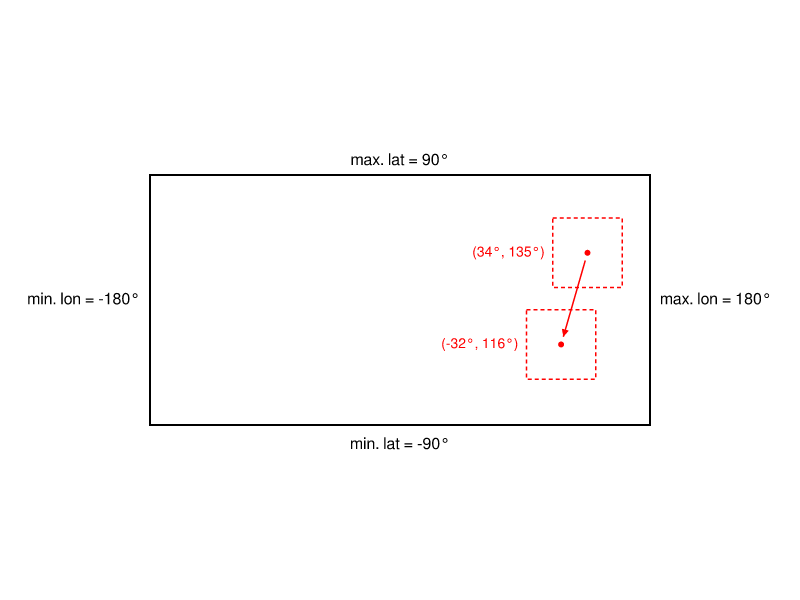
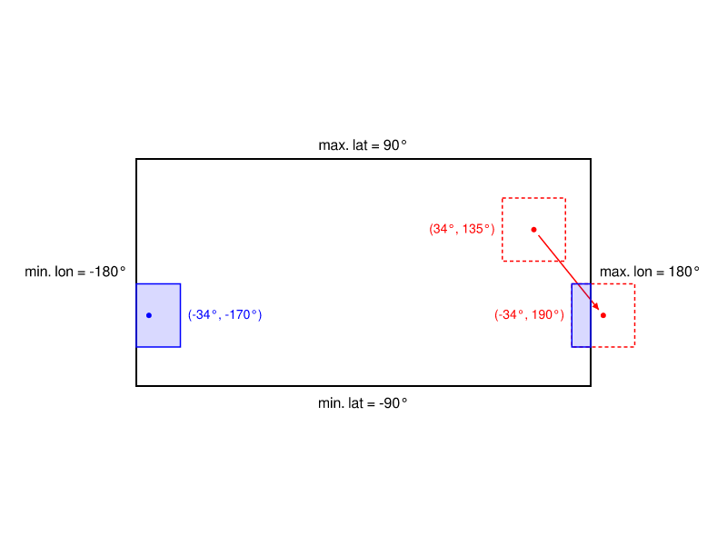
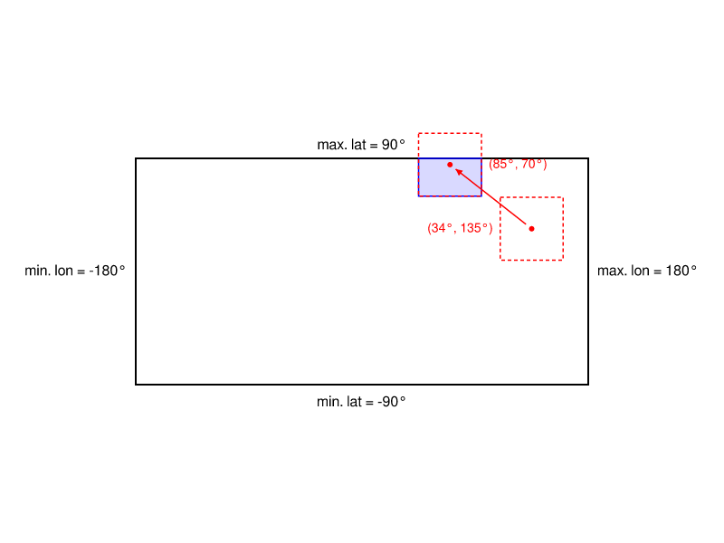
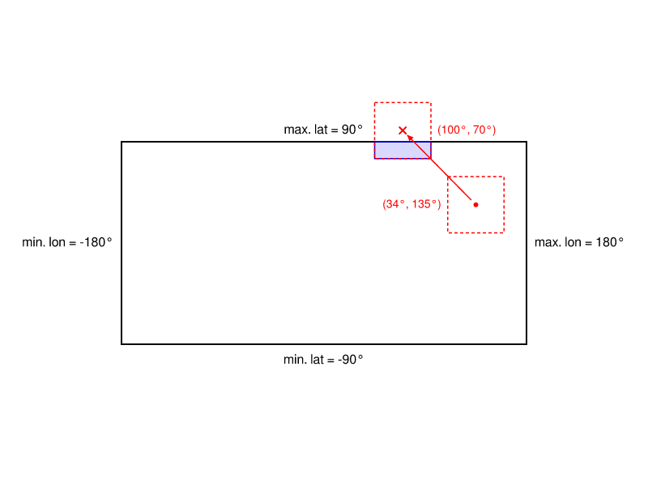
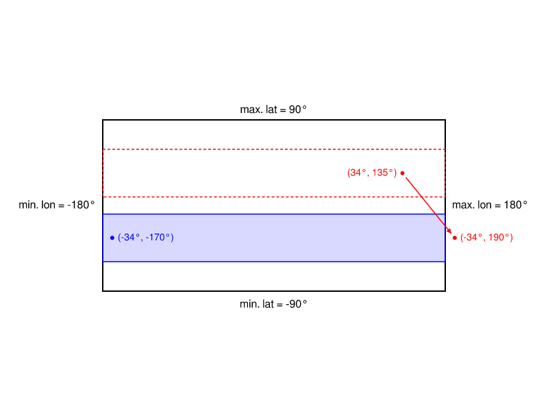

# Osmosis Anywhere

This plugin transforms coordinates in OpenStreetMap data by any user-designated amount.

## Usage

```bash
osmosis \
    --read-empty \
    --oss-anywhere offset="<lat>,<lon>" \
    --write-null
```

## Examples

The following are illustrations of how the plugin handles coordinate transforms. For all
coordinates:

- The latitude value is between +-90 degrees
- The longitude value is between +-180 degrees

### Transformed Coordinate & Bounds Inside Limits

This is a golden-path example where a node (an its bounds) latitude and longitude values were
transformed to an area inside the limits.



### Transformed Coordinate & Bounds Exceeding Longitude Limits

The node (and its bounds) has been transformed so the longitude exceeds +180 degrees and wraps
around to the opposite side.



### Transformed Coordinate Inside Limits But Bounds Exceed Latitude

While the transformed node in this example is inside the limits, its bounds can be seen to exceed
them. In this case, the bounds are clipped to the max latitude and **do not wrap around**.



### Transformed Coordinate Outside Latitude Limits

This is an error condition. A transformed coordinate that lies outside of the latitude limits will
result in a runtime error.



### Original Bounds Spanned The Entire World

When the bounds of a node span the full +-180 degree longitude, no transformation occurs on the
latitude values of the bounds.



## License

This program is free software: you can redistribute it and/or modify it under the terms of the GNU
General Public License as published by the Free Software Foundation, either version 3 of the
License, or (at your option) any later version.

This program is distributed in the hope that it will be useful, but WITHOUT ANY WARRANTY; without
even the implied warranty of MERCHANTABILITY or FITNESS FOR A PARTICULAR PURPOSE. See the GNU
General Public License for more details.

You should have received a copy of the GNU General Public License along with this program. If not,
see <https://www.gnu.org/licenses/>.
